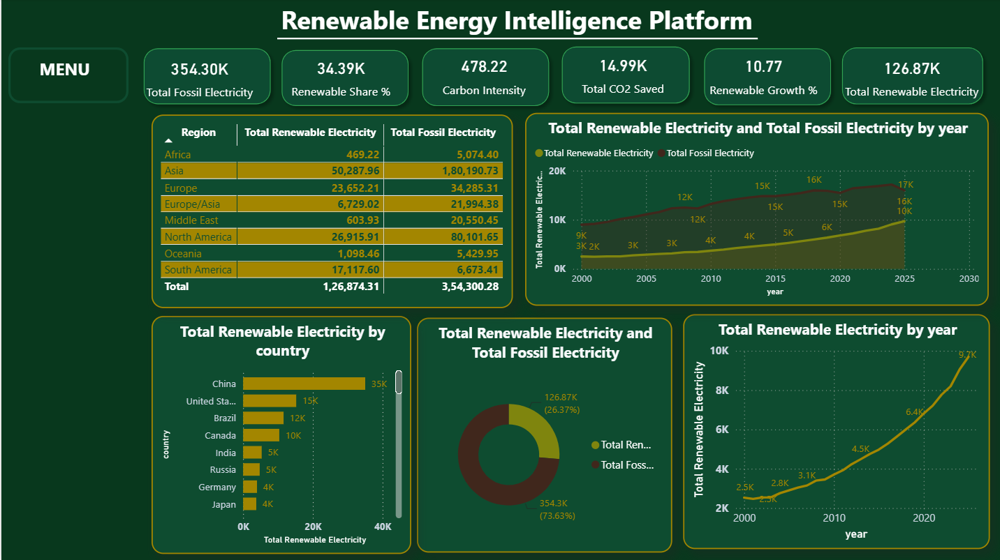
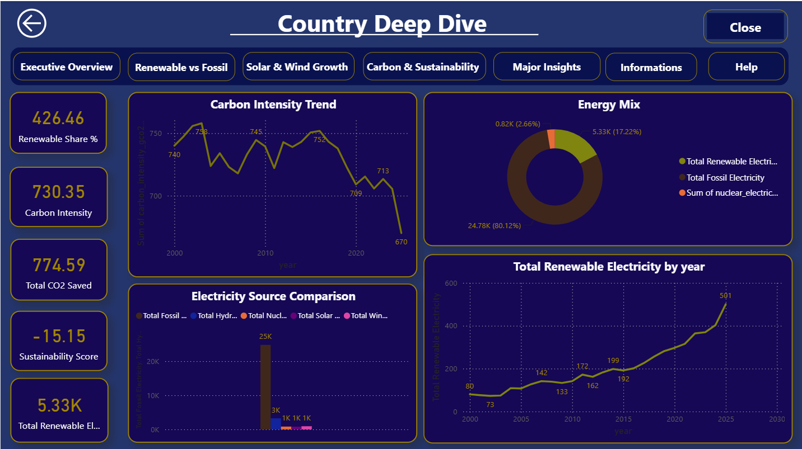
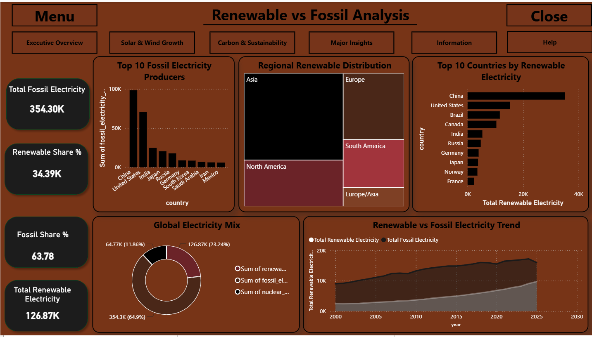
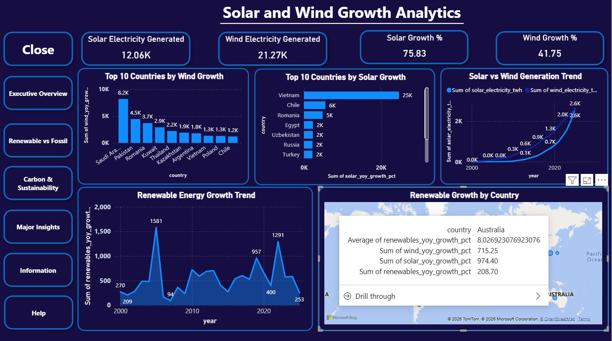
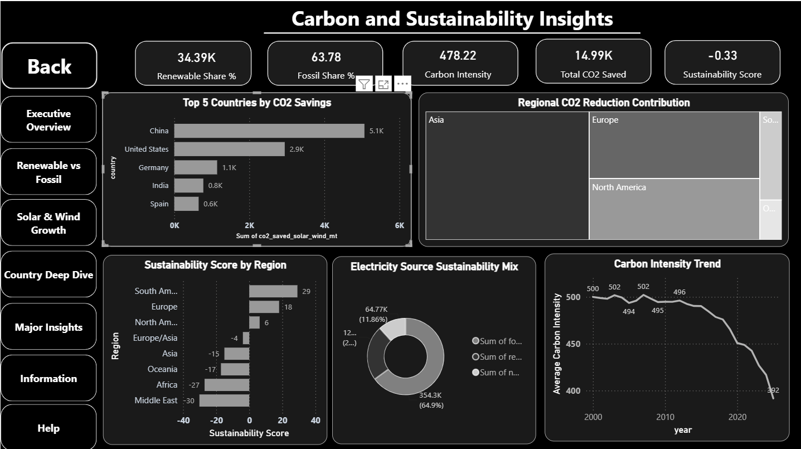
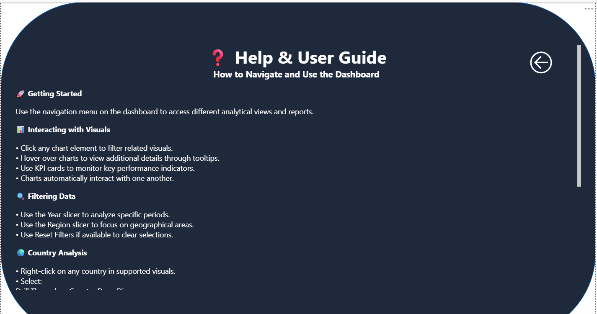
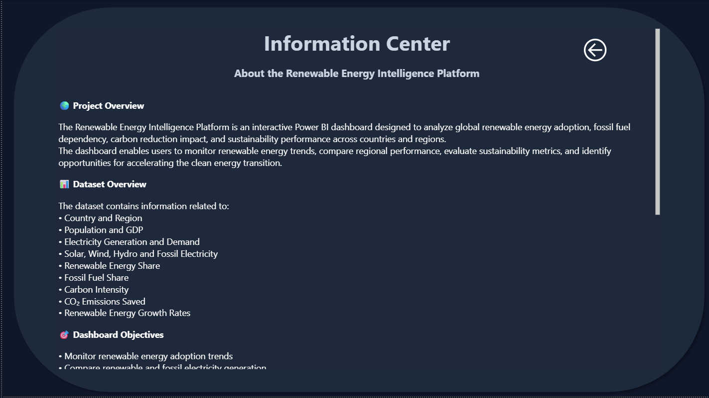

# Renewable Energy Intelligence Platform

## Power BI Data Analytics & Business Intelligence Project

An interactive Power BI dashboard designed to analyze renewable energy generation, fossil-fuel electricity, energy growth, geographical patterns, and sustainability indicators.

The project transforms renewable energy data into an interactive business intelligence solution using **Power BI, Power Query, DAX, data modeling, and interactive dashboard design**.

---

## Project Overview

The Renewable Energy Intelligence Platform provides a comprehensive view of global renewable energy trends and their relationship with fossil-fuel electricity generation.

The dashboard enables users to explore:

- Renewable and fossil electricity generation
- Renewable energy growth trends
- Solar and wind energy development
- Regional and country-level energy patterns
- Carbon intensity and CO₂ savings
- Renewable energy share
- Long-term energy transition trends
- Key insights derived from the underlying data

The platform is designed to provide both **high-level executive insights** and **detailed analytical exploration** through interactive filters and navigation.

---

## Objectives

The main objectives of this project are to:

- Analyze global renewable electricity generation trends
- Compare renewable and fossil electricity generation
- Identify major renewable energy-producing countries and regions
- Analyze solar and wind energy growth
- Evaluate sustainability and carbon-related indicators
- Track changes in renewable energy adoption over time
- Create an interactive and user-friendly Power BI reporting solution
- Present complex energy data through clear and actionable visualizations

---

## Tools & Technologies

| Tool / Technology | Purpose |
|---|---|
| **Power BI** | Dashboard development and data visualization |
| **Power Query** | Data cleaning, transformation, and preparation |
| **DAX** | Measures, KPIs, calculations, and analytical logic |
| **Data Modeling** | Structuring relationships and analytical datasets |
| **Interactive Visualizations** | Trends, comparisons, rankings, and geographical analysis |

---

## Dashboard Pages

### Page 1 — Executive Overview

Provides a high-level summary of renewable energy performance through key performance indicators, regional comparisons, country rankings, and renewable versus fossil electricity trends.

**Key areas include:**
- Total Renewable Electricity
- Total Fossil Electricity
- Renewable Share %
- Carbon Intensity
- Total CO₂ Saved
- Renewable Growth %
- Regional comparisons
- Country-level renewable electricity ranking
- Renewable electricity trends




### Page 2 — Geographical Analysis

Provides regional and country-level analysis of renewable electricity generation.

**Key areas include:**
- Regional renewable electricity generation
- Country-level comparisons
- Country rankings
- Geographical distribution
- Regional energy patterns




### Page 3 — Renewable vs Fossil

Analyzes renewable and fossil electricity generation and highlights long-term energy transition patterns.

**Key areas include:**
- Renewable vs fossil electricity comparison
- Historical generation trends
- Renewable energy share
- Energy transition patterns
- Regional comparisons




### Page 4 — Solar Wind Growth

Analyzes the development and growth of solar and wind energy generation over time.

**Key areas include:**
- Solar energy growth
- Wind energy growth
- Historical trends
- Comparative growth analysis
- Renewable energy development patterns




### Page 5 — Sustainability Analysis

Examines sustainability and environmental indicators associated with renewable energy development.

**Key areas include:**
- Carbon intensity
- CO₂ savings
- Renewable energy share
- Renewable growth
- Sustainability trends




### Page 6 — Help & Guide

Provides navigation and usage guidance to help users interact with the Power BI dashboard effectively.




### Page 7 — Information Centre

Provides supporting information about the project, dataset, metrics, and analytical context.



---

## Key Performance Indicators

The dashboard includes several analytical KPIs, including:

- **Total Renewable Electricity**
- **Total Fossil Electricity**
- **Renewable Share %**
- **Carbon Intensity**
- **Total CO₂ Saved**
- **Renewable Growth %**

These KPIs provide a concise overview of renewable energy performance and the broader energy transition.

---

## Data Preparation & Transformation

The dataset was prepared and transformed using **Power Query** before being used for analysis.

The data preparation process included:

- Data cleaning
- Data type transformation
- Handling and standardizing fields
- Data preparation for analysis
- Creating analytical columns
- Structuring data for Power BI
- Preparing the dataset for visualization and DAX calculations

---

## DAX & Data Modeling

**DAX (Data Analysis Expressions)** was used to create analytical measures and KPIs required for the dashboard.

The analytical layer includes calculations related to:

- Renewable electricity
- Fossil electricity
- Renewable energy share
- Renewable growth
- Carbon intensity
- CO₂ savings
- Year-over-year trends
- Regional and country-level comparisons

Data modeling was used to create an analytical structure that supports interactive filtering, cross-visual analysis, and dashboard navigation.

---

## Dashboard Features

- Interactive KPI cards
- Dynamic charts and tables
- Regional analysis
- Country-level analysis
- Renewable vs fossil comparison
- Solar and wind growth analysis
- Sustainability indicators
- Interactive slicers and filters
- Dashboard navigation buttons
- Drill-through analysis
- Interactive cross-filtering
- Information Centre
- Help & Guide

---

## Project Structure

```text
Renewable-Energy-Intelligence-Platform/
│
├── Dashboard/
│   ├── Executive_Overview.png
│   ├── Geographical Analysis.png
│   ├── Renewable_vs_Fossil.png
│   ├── Solar_Wind_Growth.png
│   ├── Sustainability_Analysis.png
│   ├── Help & Guide.png
│   └── Information_Centre.png
│
├── PowerBI/
│   └── GlobalRenewableEnergy.pbix
│
├── Dataset/
│   └── [Dataset File]
│
└── README.md
